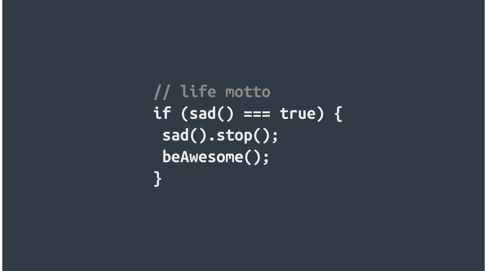

> 本站的文章可能
> 以[中文](https://fonstie.com/zh-cn/)或[英文](https://fonstie/en/)两种语言书
> 写，其中部分文章可能是双语，也有部分文章只有[中文](https://fonstie/zh-cn/)或
> 者[英文](https://fonstie/en/)版本，请读者按需阅读。

> The articles on this site may be written in [Chinese](https://fonstie/zh-cn/) or
> [English](https://fonstie/en/), some of them may be bilingual, and some of them
> are only available in [Chinese](https://fonstie/zh-cn/) or
> [English](https://fonstie/en/). Please read them as needed.

## 关于我
- **昵称**：
    - 中文：青梓朝梧	
    - 英语ID：Fonstie/Fung Szeti
        - 关于英文名的解释：
            - Fonstie：其实就是中文名的谐音，反正我觉得听上去挺像的，算是自创的吧。
            - Fung Szeti：这个就是中文名的英文写法，应该是有对照表的，当然应该只有姓氏的英文对照，毕竟名的可能性太大了。不过由于我的名字三个都是姓氏，所以都能找到对应的，后来就用这个了。

- **性别**：男（人称代词：他/He/Him）
- **学习经历**：
    - 暂时略过
- **喜欢的东西**：
    - *运动*：呃，大概，徒手运动？
    - *音乐*：纯音乐，其他的就很杂了
    - *影视*：特摄啦，然后就是一些动漫，然后就是一些优秀的电视剧
    - *书籍*：正经书就是技术类的，还有一些科幻的或游戏或特摄的设定/延伸/衍生补充的书籍，网文？（大概吧？其实现在已经不怎么看了）。不正经的书就算了。

## 关于该博客

大概，因为无聊？	

## 喜欢的句子

 
雄关漫道真如铁，而今迈步从头越，从头越，苍山如海，残阳如血。


 
横空出世，莽昆仑，阅尽人间春色。飞起玉龙三百万，搅得周天寒彻。


## 技能

#### 编程语言：

 - *已解锁*：
    - C
 - *待解锁*：
    - C++
    - Verilog
    - Rust
    - Chisel
    - Python
    - Go
    - Java
    - Scala
    - Lua
    - JavaScript
    - CSS
    - TypeScript
    - ASM
    - WASM

#### 工具：

 + *已解锁*：
    + 暂无
 + *待解锁*：
    + Neovim
    + Makefile
    + GCC
    + Justfile

## 开发环境

+ OS：Arch Linux（当前）/NixOS/Gentoo/Fedora
+ Shell：Bash/Zsh/Nushell/
+ Editor：Neovim/Emacs/VSCode
+ Terminal Emulator：Kitty + Alacritty + Foot/Wezterm/Konsole
+ Desktop Environment/Window Manager：KDE Plasma/Hyprland
+ Display Manager：SDDM
+ Lock：Hyprlock（while use Hyprland)
+ Paper：Hyprpaper（while use Hyprland)
+ Fonts：JetBrains Mono Nerd Font Mono + LXGW Wenkai
